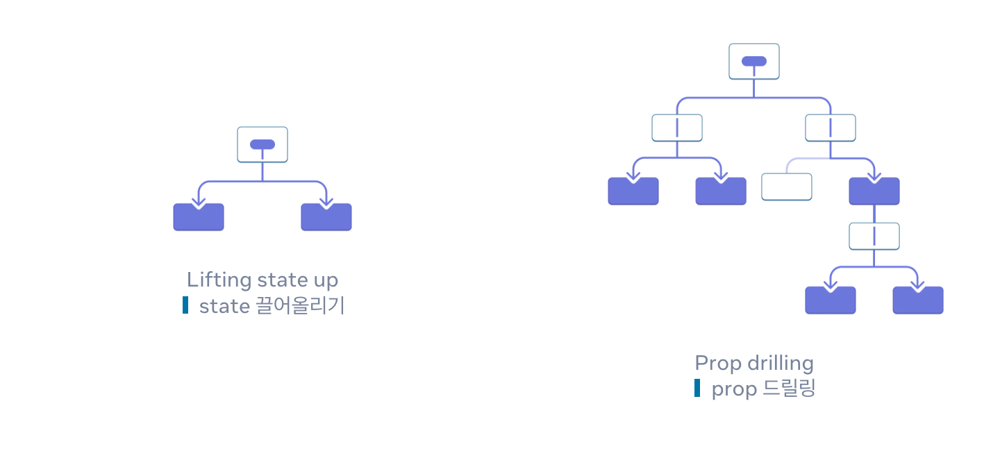

# props 전달의 문제

Props 전달은 UI 트리를 통해 데이터를 사용하는 컴포넌트로 명시적으로 연결할 수 있다.

그러나 트리 깊숙이 전달이 필요하거나 많은 컴포넌트에 동일한 prop이 필요한 경우에는 prop 드릴링이 발생할 수 있다.

<figure><figcaption></figcaption></figure>

React의 Context를 이용하면 props를 드릴링하여 전달하지 않고도 데이터를 바로 사용할 수 있다.



같은 값이 중복인 경우 UI 트리에서 가장 가까운 Provider 값을 사용한다.

## 실습



props 드릴링을 제거하고 값을 직접 받을 수 있도록 변경해보기

## 리듀서와 컨텍스트로 확장하기



useReducer로 state를 관리하고 provider를 이용해 state와 dispatch 함수를 감싸준다.

복수의 provider를 컴포넌트로 만들어 하나로 만들어준다.

useContext를 커스텀 훅으로 만들어서 재사용가능하도록 만들어준다.
